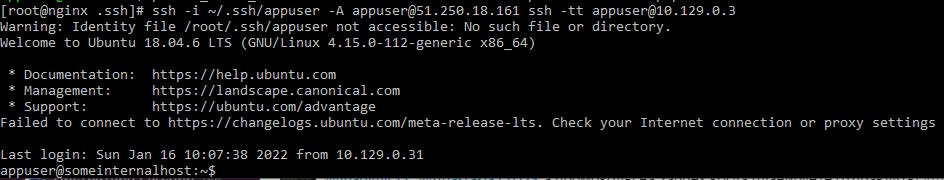

# elistratkin_infra

bastion_IP = 51.250.31.218
someinternalhost_IP = 10.129.0.3

*Знакомство с облачной инфраструктурой. Yandex.Cloud*
**Самостоятельное задание**
Исследовать способ подключения к someinternalhost в одну команду из вашего рабочего устройства, проверить работоспособность найденного решения и внести его в README.md в вашем репозитории. 
Для моего случая это будет <strong>ssh -i ~/.ssh/appuser -A appuser@51.250.31.218 ssh -tt appuser@10.129.0.3</strong>

 
